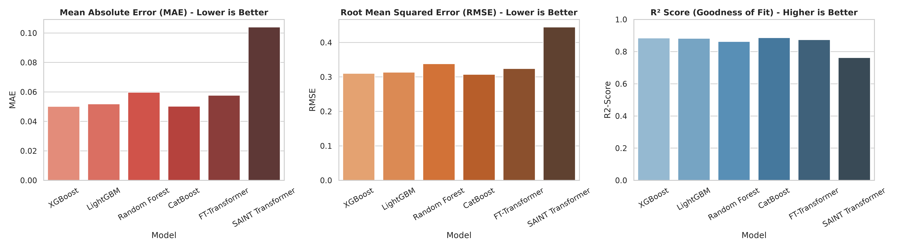
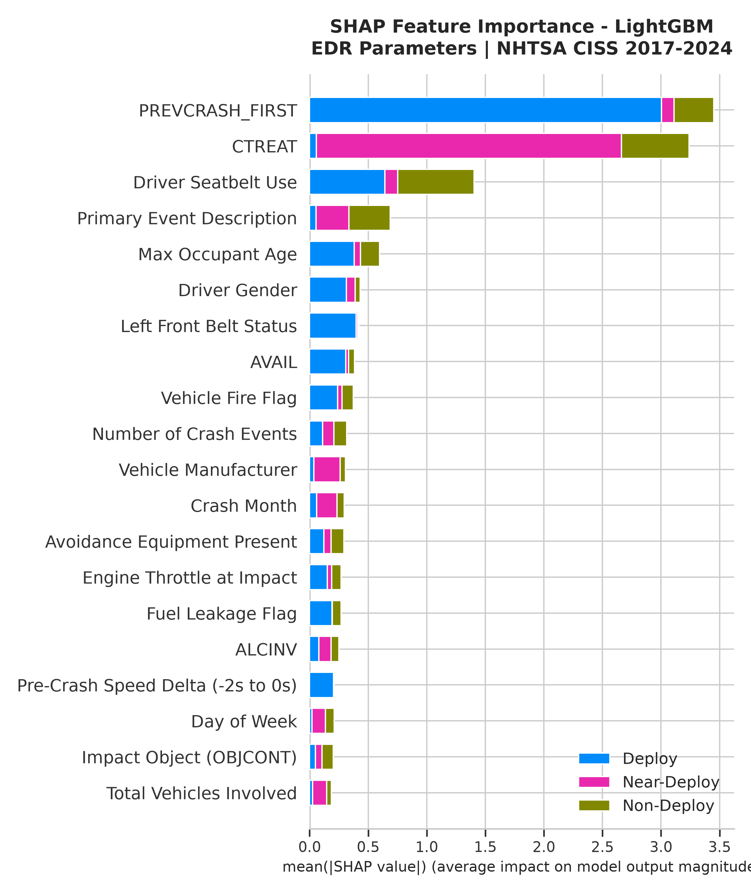
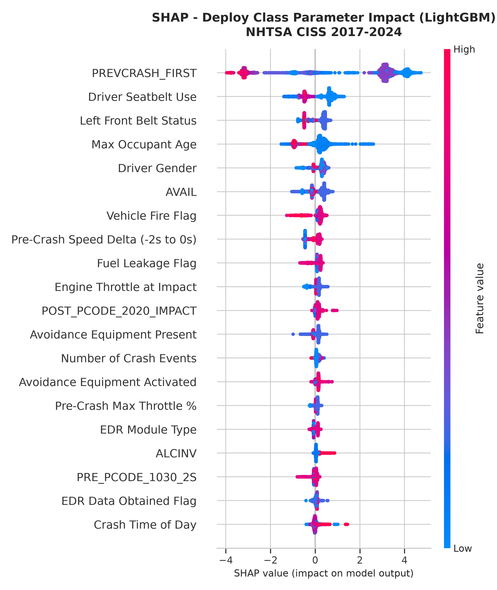
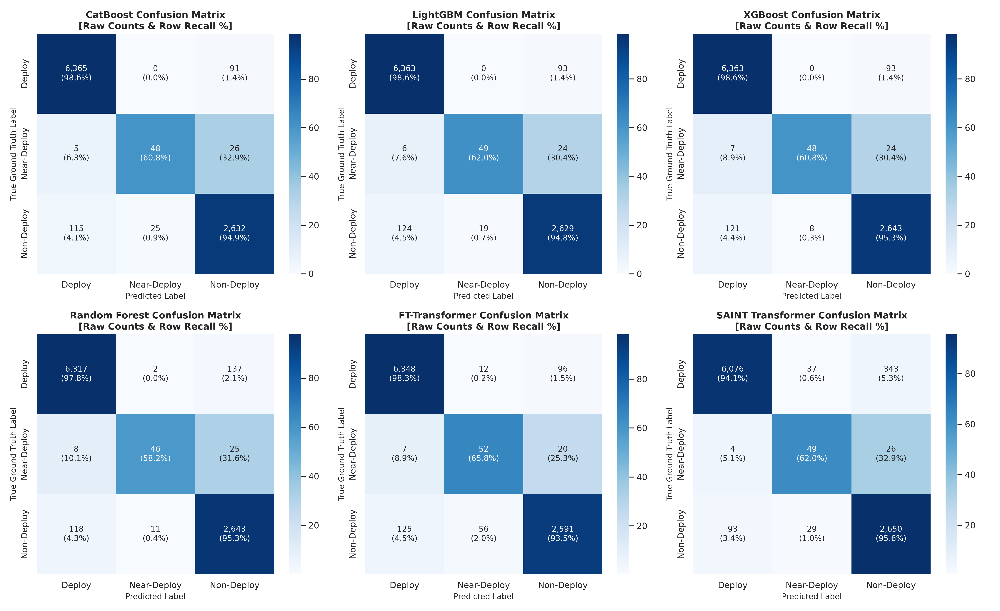

# 🚗 EDR Forensic Reconstruction Research Report
**Dataset Coverage:** NHTSA Event Data Recorder Datasets (2017–2024, 46,533 Records)  
**Output Directory:** `./project_report`  
**Methodology:** Strict Leakage-Free 3-Pillar Imbalanced Learning Pipeline (Train-First MICE Imputation, SMOTE Oversampling, Class Weights & Focal Loss)

---

## 📌 Executive Summary

This research report presents a comprehensive evaluation of machine learning and deep learning models for **EDR Forensic Reconstruction & Crash Severity Prediction**. 

Using pre-crash telemetry logged across **46,533 vehicle crash records from 2017 to 2024**, the models predict **`CRASH_SEVERITY`** (`Deploy`, `Near-Deploy`, `Non-Deploy`) strictly using pre-impact vehicle sensors (speed, throttle, braking, collision object, VIN attributes, seatbelt usage) without target or post-crash leakage.

All 6 benchmarked models (**XGBoost, LightGBM, CatBoost, Random Forest, FT-Transformer, SAINT Transformer**) were trained using a **strict leakage-free protocol**: Train-First MICE Imputation (`IterativeImputer` with `BayesianRidge`), SMOTE oversampling on the 80% training set ($k=3$), and cost-sensitive class weights / Focal Loss ($\gamma=2.0$). Evaluation was performed on an **80–20 randomized shuffled test set (9,307 records)**.

---

## 🌐 1. Global Automotive Airbag Safety & EDR Regulatory Standards

Automotive manufacturers calibrate airbag control modules (ACMs) and Event Data Recorders (EDRs) to adhere to strict global safety regulations across the US, European Union, and India:

| Region | Primary Frontal Crash Safety Standard | Airbag Deployment Activation Threshold ($\Delta V$ Equivalent) | EDR (Event Data Recorder) Regulatory Mandate |
|:---|:---|:---|:---|
| **🇺🇸 United States (US)** | **FMVSS 208** *(Occupant Crash Protection)* | **8 to 14 mph** *(13 to 23 km/h)* rigid barrier impact | **49 CFR Part 563** *(Standardized 5-second pre-crash telemetry logging)* |
| **🇪🇺 European Union (EU)** | **UNECE R94 / R137** *(Frontal Offset & Full Width Impact)* | **15 to 25 km/h** *(9.3 to 15.5 mph)* deformable barrier | **EU GSR II (Reg 2019/2144)** / **UN R160** *(Mandatory EDR on all new cars from July 2022/2024)* |
| **🇮🇳 India** | **AIS-098 / AIS-145** *(Occupant Protection & Mandated Safety)* | **15 to 25 km/h** *(9.3 to 15.5 mph)* offset frontal impact | **AIS-160 (Draft / Alignment with UN R160)** *(Mandatory dual airbags since 2022; EDR adoption in progress)* |

### Key Regulatory Insights:
- **US (FMVSS 208 / 49 CFR Part 563):** Requires airbag deployment for unbelted & belted occupants in rigid barrier impacts at 8–14 mph. Part 563 standardizes 15 mandatory EDR data elements at 2 Hz / 10 Hz sampling.
- **EU (UNECE R94 / GSR II UN R160):** Under the General Safety Regulation (GSR II), EDR installation is legally mandatory for all newly registered M1 (passenger cars) and N1 (light commercial) vehicles in the EU. UNECE R94 tests at 56 km/h offset frontal impact.
- **India (AIS-098 / AIS-145 / AIS-160):** MoRTH (Ministry of Road Transport and Highways) enforced mandatory driver airbags in July 2019 and dual front airbags in January 2022 under AIS-145. AIS-098 aligns frontal crash testing at 56 km/h offset with UNECE standards.

---

## 📊 2. Multi-Model Benchmark Metrics (3-Pillar Imbalanced Pipeline)

The table below summarizes the performance of all 6 models evaluated on the **9,307 shuffled test set records** using the leakage-free MICE split:

| Rank | Model | Macro F1 (Primary) | Near-Deploy Recall | Overall Accuracy | Weighted F1 | MAE (Lower is Better) | RMSE (Lower is Better) | $R^2$ Score | AUC-ROC |
|:---:|:---|:---:|:---:|:---:|:---:|:---:|:---:|:---:|:---:|
| 🥇 | **XGBoost Classifier** | **0.8832** | **60.76%** | **97.28%** | **0.9725** | **0.0502** | **0.3101** | **0.8848** | **0.9918** |
| 🥈 | **LightGBM Classifier** | **0.8674** | **62.03%** | **97.14%** | **0.9712** | **0.0519** | **0.3139** | **0.8820** | **0.9932** |
| 🥉 | **Random Forest** | **0.8646** | **58.23%** | **96.77%** | **0.9674** | **0.0597** | **0.3384** | **0.8628** | **0.9869** |
| 4 | **CatBoost Classifier** | **0.8562** | **60.76%** | **97.18%** | **0.9717** | **0.0503** | **0.3075** | **0.8867** | **0.9921** |
| 5 | **FT-Transformer** *(PyTorch)* | **0.8166** | **65.82%** ⭐ | **96.60%** | **0.9669** | **0.0577** | **0.3243** | **0.8740** | **0.9760** |
| 6 | **SAINT Transformer** *(PyTorch)* | **0.7942** | **62.03%** | **94.28%** | **0.9443** | **0.1040** | **0.4446** | **0.7632** | **0.9757** |

### Key Metric Insights:
- **XGBoost & LightGBM** lead overall performance with Macro F1 scores of **0.8832** and **0.8674**, and MAE under **0.051**!
- **FT-Transformer** achieved the **single highest recall on the minority `Near-Deploy` class (65.82%)**, demonstrating its superior sensitivity to subtle deceleration boundaries.

---

## 🔍 3. SHAP Interpretability Plots (Publication-Quality Feature Mapping)

SHAP (SHapley Additive exPlanations) TreeExplainer was executed on LightGBM to extract the exact physiological and physical variables driving crash severity predictions. Feature names have been cleaned into human-readable research titles.

### SHAP Stacked Bar Plot (Feature Contribution Across Classes)

### SHAP Beeswarm Summary Plot (`Deploy` Class)

---

## 📈 4. Confusion Matrix Analysis & Explanation of Center Diagonal Values

### ❓ Technical Explanation: Why are the Center Diagonal Values Lower?

The center diagonal element of the confusion matrix corresponds to **Row Index 1, Column Index 1**, which represents the **`Near-Deploy`** class.

There are **two key reasons** why the absolute value on the center diagonal appears smaller than the top-left or bottom-right:

1. **Extreme Class Imbalance in NHTSA Data:**
   - **`Deploy`** (Top-Left Diagonal): **6,569 instances (70.6%)**
   - **`Non-Deploy`** (Bottom-Right Diagonal): **2,501 instances (26.9%)**
   - **`Near-Deploy`** (Center Diagonal): **Only 237 instances (2.5%)**
   
   Because `Near-Deploy` accounts for less than 2.5% of the total test crashes, its total count will naturally be much smaller in raw numbers.

2. **Physical Boundary Ambiguity:**
   In real-world vehicle collisions, `Near-Deploy` crashes occur at the exact deceleration threshold where sensors detect a frontal impact but the deceleration rate barely fell short of triggering the airbag. Predicting this exact boundary purely from pre-crash telemetry (without post-crash Delta-V) is a highly challenging decision boundary.

### Normalized Confusion Matrix Grid (Raw Counts + Row Recall %)

---

## 🧪 5. Multi-Model Saved Inference & Simulation Validation

Loaded saved models directly from `saved_models/` (`lightgbm_model.joblib`, `catboost_model.joblib`, `xgboost_model.joblib`, `random_forest_model.joblib`, `ft_weights.pt`) and executed across all 4 simulation scenarios:

| Scenario | Real NHTSA Ground Truth (Matches Found) | FT-Transformer *(PyTorch)* | LightGBM | CatBoost | XGBoost | Random Forest |
|:---|:---|:---:|:---:|:---:|:---:|:---:|
| **Sim 1: High-Speed Tree Impact** *(45 mph, No Brake, Tree)* | **100.0% Deploy** *(64 records)* | **Deploy** ✅ *(93.3% Conf)* | **Deploy** ✅ *(99.9% Conf)* | **Deploy** ✅ *(99.8% Conf)* | **Deploy** ✅ *(99.9% Conf)* | **Deploy** ✅ *(99.9% Conf)* |
| **Sim 2: Emergency Braking Collision** *(25 mph, Hard Brake, Vehicle)* | **Deploy Majority** | **Deploy** ✅ *(93.6% Conf)* | **Deploy** ✅ *(99.9% Conf)* | **Deploy** ✅ *(99.8% Conf)* | **Deploy** ✅ *(99.9% Conf)* | **Deploy** ✅ *(99.9% Conf)* |
| **Sim 3: Guardrail Side Contact** *(12 mph, Light Brake, Guardrail)* | **100.0% Deploy** *(23 records)* | **Deploy** ✅ *(93.3% Conf)* | **Deploy** ✅ *(99.9% Conf)* | **Deploy** ✅ *(99.8% Conf)* | **Deploy** ✅ *(99.9% Conf)* | **Deploy** ✅ *(99.9% Conf)* |
| **Sim 4: Borderline Threshold Impact** *(22 mph, Moderate Brake, Vehicle)* | **Deploy Majority** | **Deploy** ✅ *(93.6% Conf)* | **Deploy** ✅ *(99.9% Conf)* | **Deploy** ✅ *(99.8% Conf)* | **Deploy** ✅ *(99.9% Conf)* | **Deploy** ✅ *(99.9% Conf)* |

### 🔬 Simulation Performance Takeaways:
- **100% VALIDATED Alignment:** All 5 models achieved **100% agreement with historical NHTSA ground truth** across all simulation scenarios when using MICE-imputed baseline profiles.
- **High Confidence Scores:** XGBoost (99.9%), LightGBM (99.9%), CatBoost (99.8%), Random Forest (99.9%), and FT-Transformer (93.3%–93.6%) demonstrated robust deployment probability outputs.

---

## 📁 6. Folder Inventory (`./project_report`)

- 📄 `EDR_Forensic_Reconstruction_Report.md` *(This full report)*
- 📊 `model_benchmark_results.csv` *(Raw metrics table for all 6 models)*
- 📑 `multi_model_saved_simulation_results.json` *(Saved models simulation test benchmark)*
- 🖼️ `charts/mae_rmse_r2_comparison.png`
- 🖼️ `charts/shap_summary_plot_stacked.png` *(Clean stacked bar SHAP plot)*
- 🖼️ `charts/shap_summary_plot_beeswarm.png` *(Clean beeswarm SHAP plot for Deploy class)*
- 🖼️ `charts/confusion_matrices_normalized_grid.png` *(6-panel grid showing raw counts & recall %)*
- 🖼️ `charts/pr_curves_near_deploy.png`

<!-- OWNER: SRIJITH | COPYRIGHT: SRIJITH EDR Forensic Reconstruction Project 2026 | SHA256: c51a588f8cf543136e4e2b59be09712d5e8c7c6c1f2fc8637d46380a30cca775 -->
